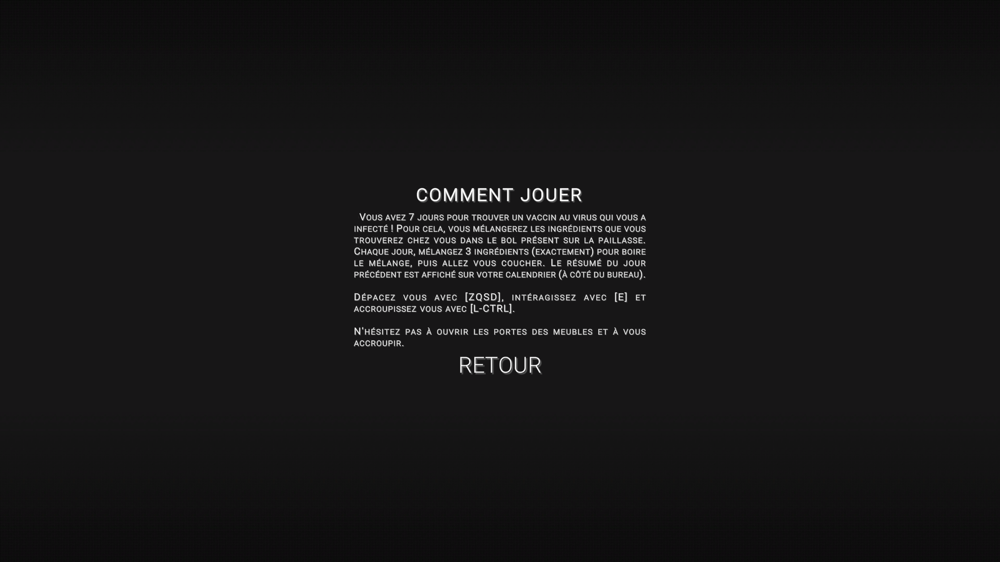

# 7 Days to Cure - AEIF-GameJam-2020

Our submission for the [AEIF](https://www.helloasso.com/associations/aeif) GameJam 2020, following
the theme "Virus", we built this game from scratch in 48h (and won!).

Note: as the AEIF is a french organisation, 7 Days to Cure is in french only.

# How to play

You are a scientist (a little crazy I must say) and you caught the latest fashionable virus. The
problem is that this one is rather deadly with 1 day of incubation and 7 days of illness before
certain death. Fortunately, your scientific friends have been able to gather information about the
virus that may allow you to find a cure. It's up to you to mix the correct ingredients to survive!

# Some Screenshots

|   |  |
| -------------------------- | --------------------------- |
|  |   |

# Collaborators

- Vincent COMMIN aka [Altimors](github.com/Altimors)
- Louis LEENART aka [TheBoje](github.com/TheBoje)

# Build

- Windows : [link](https://boje.itch.io/7-days-to-cure)
- Web (online) : [boje.itch.io](https://boje.itch.io/7-days-to-cure)
